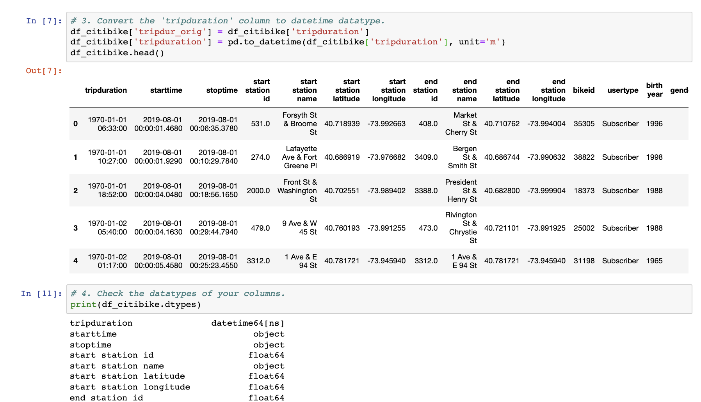
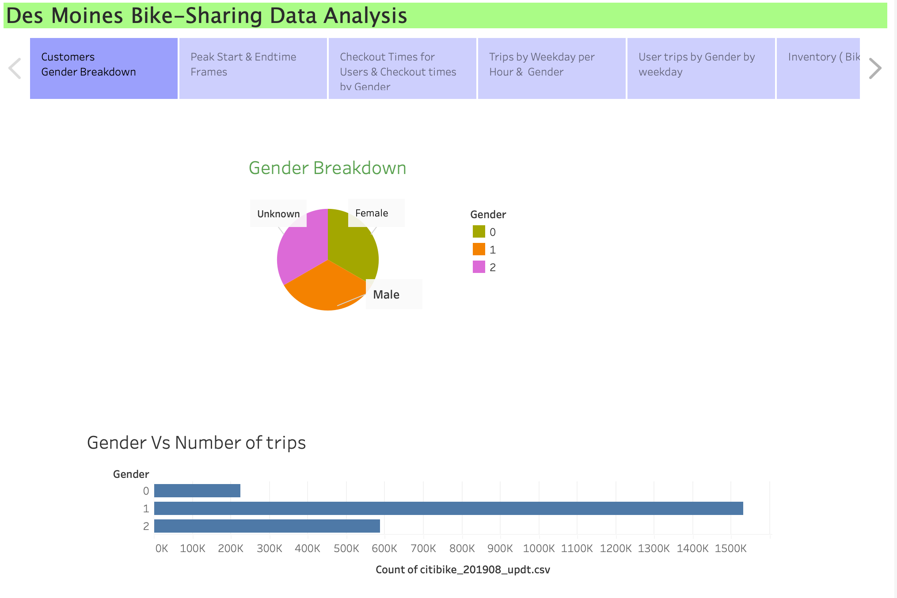
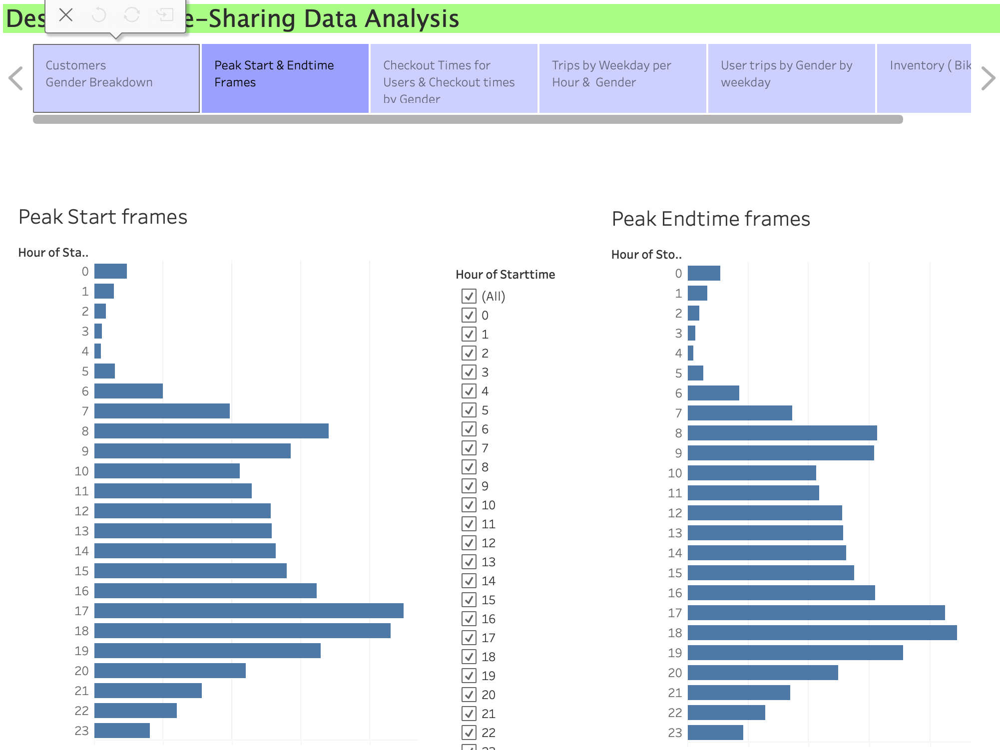
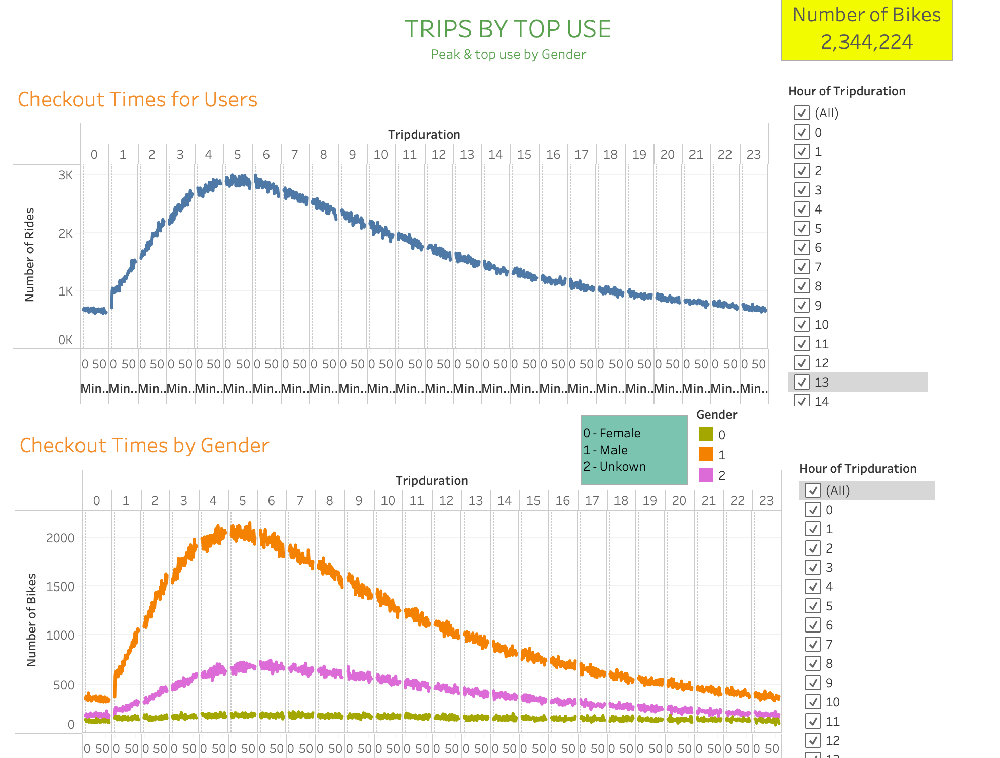
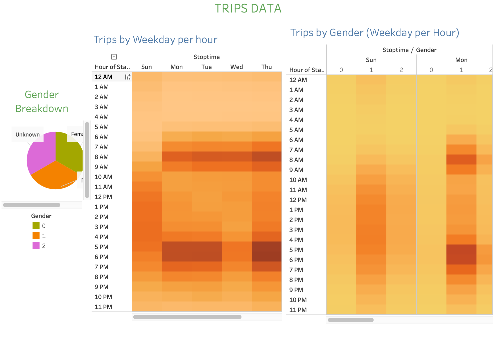
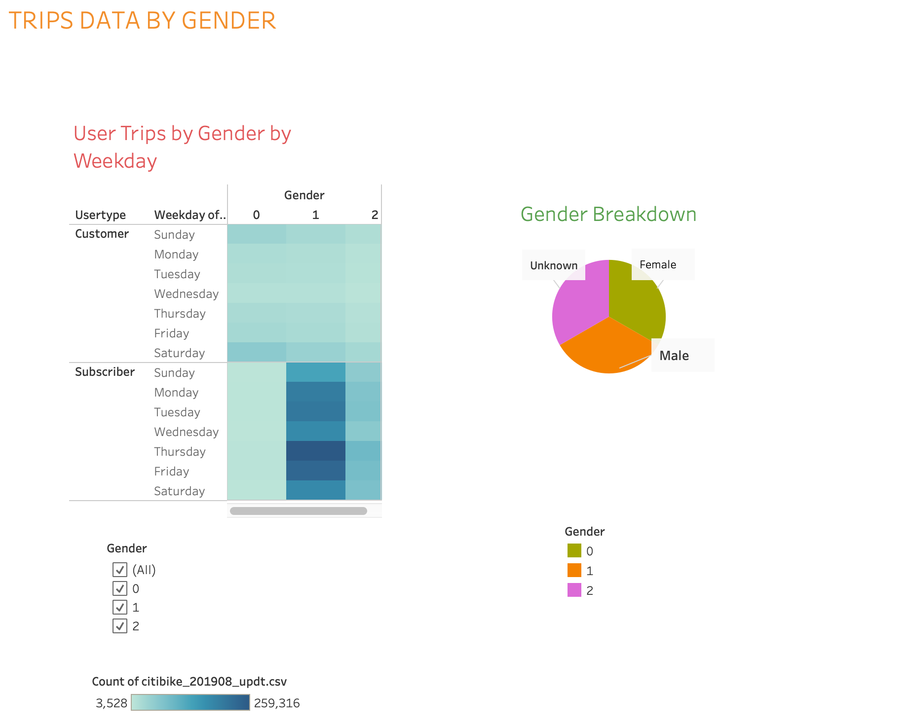
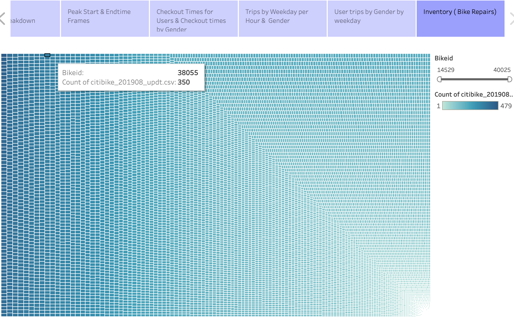

# Des Moines Bike Sharing Analysis

## Overview
Today's challenge is all about convincing the clients that the bike-sharing program in Des Moines is a solid business proposal. For this analysis, using Pandas to change the "tripduration" column from an integer to a datetime datatype. Then, using the converted datatype, creating a set of visualizations to:

- Show the length of time that bikes are checked out for all riders and genders
- Show the number of bike trips for all riders and genders for each hour of each day of the week
- Show the number of bike trips for each type of user and gender for each day of the week.

Finally, adding these new visualizations to the final presentation and analysis to pitch to investors.

# Summary & Results

This assignment consists of two technical analysis deliverables and a written report to present your results. You will submit the following:

Deliverable 1: Change Trip Duration to a Datetime Format

Deliverable 2: Create Visualizations for the Trip Analysis

Deliverable 3: Create a Story and Report for the Final Presentation

### Deliverable 1
Using Python and Pandas functions, converting the "tripduration" column from an integer to a datetime datatype to get the time in hours, minutes, and seconds (00:00:00). After you convert the "tripduration" column to a datetime dataytpe, export the DataFrame as a CSV file to use for the trip analysis in Deliverable 2.

Here is the Screenshot showing the conversion of data type for the trip duration column

Below is the Screenshot showing the dataframe exported as a csv file without index
1

### Deliverable 2 & 3

Taking a look at the feature of tableau which is the story. This Story helps the client understand more clearly the data collected & analized for this business proposal.

Below are some screenshot showing the story for the bike sharing data analysed for Des Moines.

