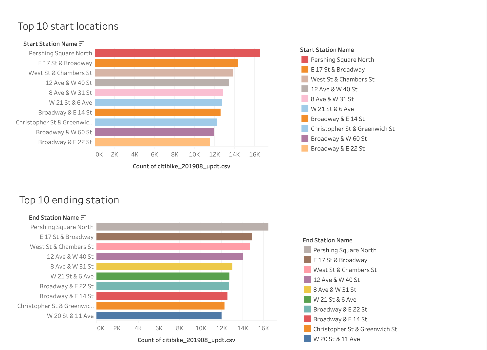

# Des Moines Bike Sharing Analysis

## Overview
Today's challenge is all about convincing the clients that the bike-sharing program in Des Moines is a solid business proposal. For this analysis, using Pandas to change the "tripduration" column from an integer to a datetime datatype. Then, using the converted datatype, creating a set of visualizations to:

- Show the length of time that bikes are checked out for all riders and genders
- Show the number of bike trips for all riders and genders for each hour of each day of the week
- Show the number of bike trips for each type of user and gender for each day of the week.

Finally, adding these new visualizations to the final presentation and analysis to pitch to investors.

# Summary & Results

This assignment consists of two technical analysis deliverables and a written report to present your results. You will submit the following:

Deliverable 1: Change Trip Duration to a Datetime Format

Deliverable 2: Create Visualizations for the Trip Analysis

Deliverable 3: Create a Story and Report for the Final Presentation

### Deliverable 1
Using Python and Pandas functions, converting the "tripduration" column from an integer to a datetime datatype to get the time in hours, minutes, and seconds (00:00:00). After you convert the "tripduration" column to a datetime dataytpe, export the DataFrame as a CSV file to use for the trip analysis in Deliverable 2.

Here is the Screenshot showing the conversion of data type for the trip duration column

Below is the Screenshot showing the dataframe exported as a csv file without index

### Deliverable 2 & 3

Taking a look at the feature of tableau which is the story. This Story helps the client understand more clearly the data collected & analized for this business proposal.

Below are some screenshot showing the story for the bike sharing data analysed for Des Moines.

- Here are the five visualizations that you created in Deliverable 2.

The Screenshoot above shows the total number of riders for the month of August 2019. We can see there are two types of riders represented in this screen: Customers and Subscribers. The visualization uses a pie chart to show the proportion of each User Type & Gender. The pie chart shows that over 81% of customers are Subscribers. This visualization is important to future investors because a solid base of Subscribers is nessecary for long-term viability and return on investment.

These two visualizations show the length of time for each Hour as well as the number of bikes. This visualization gives a clear understanding of how all of the mentioned factors are working together to create the story of daily hourly useage.

This visualization tells investors the majority of rides are between 4.5 and 6.5 hours in duration. This is important becasue of at least two factors: one, longer rides during peak hours mean fewer bikes may be available at popular stations. Secondly, Customers taking 4.5 to 6.5 hour bike rides represent higher profit margins but also more wear on the bikes. The lower visualization breaks down rental times by Gender. This shows that males are a much larger portion of the bike rentals, but the rental times are fairly equivalent between all Genders.

Here the heatmap has been used to show the concentration of trips by different hours of the day over a week. It is also grouped by Gender. Male and Female usage appears to occur most from 7-9AM and 4-8PM on weekdays, probably coinciding with daily work commutes.

This visualization also uses a heatmap, but breaksdown usage by User Type and Gender throughout the week. Here we can see that the Male Subscribers have a much higher concentration compared to the others.

-  Two additional visualizations suggested for future analysis are:

This is an additional visualization suggested for future analysis. The above screenshoot shows the bike repairs required with reference to Bikeid.

The above Top 10 start & end time locations & the Bottom 10 start & end time locations visualizations is a very good data for analyzing the data. This visualization helps the investors to help forsee the time slots & areas for bike repairs or inventory. It also gives the details where the bikes need to present or how many bikes need to be present in these regions/locations to meet the customers demand.

TABLEAU PUBLIC URL
https://public.tableau.com/app/profile/shweta7357/viz/DESMOINESBIKE-SHARINGANALYSIS/Story1?publish=yes

DES MOINES BIKE SHARING ANALYSIS 
https://github.com/skhidrapure/bikesharing
